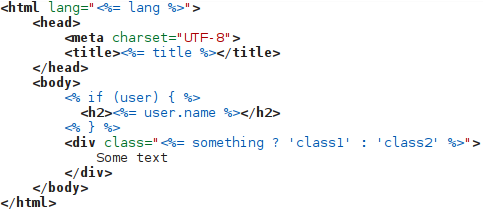

# kate-ejs

Embedded JavaScript ([EJS][ejs]) template support for the
Kate's HTML highlighter.

[ejs]:https://github.com/mde/ejs

## Example

## Installation

First find the location of the kate/katepart syntax files:

    find /usr -iname "katetemplate.xml"

This will output something like this:

    /usr/share/apps/katepart/syntax/katetemplate.xml

The file `ejs.xml` has to be then copied to the
`/usr/share/apps/katepart/syntax` directory. After restarting
Kate, the new highlighter should be available. By default it supports
files with the `*.ejs` extension. The extension can be configured in
Settings -> Configure Kate -> Editor Component -> Open/Save ->
Modes & Filetypes.

## Similar projects:

 * <https://github.com/eMerzh/kate-twig>

## License

The MIT License
